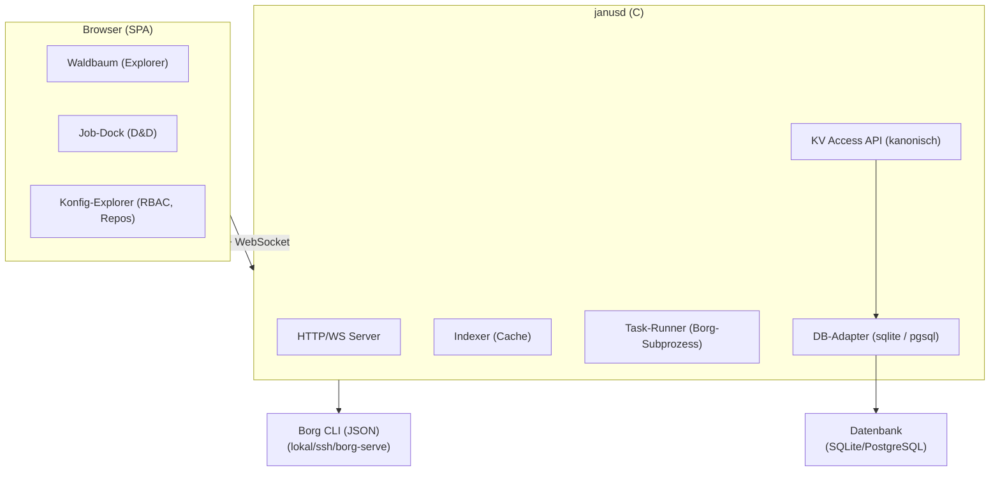

# Janus – Architekturvertrag

Version: 0.1.3
Status: ENTWURF – erneute Freigabe erforderlich

## 1. Überblick

Janus ist ein Web-UI für Borg Backup, das einen intuitiven, Drag-&-Drop-basierten
Workflow auf Linux-systemd-Systemen bereitstellt. Das Design orientiert sich an
CleanMyMac: aufgeräumt, visuell klar, interaktionsgetrieben.

Produktziel: Janus macht Borg angenehm, verständlich und vertrauenswürdig – für
das Anlegen von Backups, die Erkundung von Archiven und die Wiederherstellung.
Borg ist häufig schweigsam und Remote-Speicher kann langsam sein; Janus macht
diese Arbeit transparent und nachvollziehbar: laufendes, verständliches Feedback
zu Fortschritt, voraussichtlicher Dauer/Restzeit und sauberem Cancel. Dabei wird
keine erfundene Gewissheit oder erfundener Fortschritt suggeriert.

Die Fortschritts-Feedback-Architektur läuft über WebSocket: Tasks melden Phasen,
Zähler und Status; Cancel-Anfragen gehen vom Frontend an den Daemon und werden an
Task-Runner, DB-Adapter und Borg-Subprozess weitergegeben. Nicht jede zugrunde
liegende Borg-/DB-Operation ist sofort abbrechbar; der Vertrag verspricht keinen
sofortigen Abbruch, sondern einen sauberen, nachvollziehbaren Ablauf.

## 2. Systemkomponenten



## 3. Backend: janusd

- **Sprache**: ausschließlich C (C99, POSIX).
- **HTTP/WebSocket-Server**: civetweb (eingebettet, lizenzkompatibel MIT).
- **JSON**: cJSON (eingebettet) als Parser/Serializer für einzelne begrenzte
  Objekte. Borg-JSONL wird inkrementell/streamend geparst; eine ganze große
  Borg-Antwort wird niemals als cJSON-DOM im Speicher gehalten.
- **Borg-Integration**: Subprozess-Steuerung (`posix_spawn` / `fork+exec`),
  Parsen von `--json` / `--json-lines`-Ausgaben. Kein Python-Embedding.
- **Secrets**: `systemd-creds` oder `BORG_PASSCOMMAND`; niemals Klartext in
  Konfigurationsobjekten.
- **Build**: CMake (>= 3.20), keine Autotools.

## 4. Repo-Zugriffsmodell

Ein `Repository`-Objekt kapselt alles für den Zugriff auf ein Borg-Repo:

| Transporttyp   | Konfigurationsfelder                             |
|----------------|--------------------------------------------------|
| Lokal          | `path`                                           |
| SSH            | `ssh_host`, `ssh_user`, `ssh_port`, `path`       |
| SFTP           | `sftp_host`, `sftp_user`, `sftp_port`, `path`    |
| Borg-Server    | `borg_host`, `borg_user`, `borg_port`, `path`    |

Zugriffskonfigurationen werden in der DB gespeichert; Passphrasen und
SSH-Schlüssel werden über referenzierte Secret-IDs (systemd-creds oder
verschlüsselt in der DB mit einem Master-Key) aufgelöst, nie inline.

## 5. Persistenz: KV Access API und Backend-Adapter

Die Persistenz ist zweistufig aufgebaut:

1. **KV Access API (kanonisch)**: eine einzige C-Key/Value-Zugriffs-API
   (`get`, `put`, `delete`, `prefix-scan` mit begrenzten Seiten/Cursor sowie
   Batch-/Transaktionssemantik), die von **allen Fachmodulen** verwendet wird.
   Kein Fachmodul darf direkt Backend-spezifische DB-Aufrufe nutzen.
2. **Backend-Adapter**: SQLite (libsqlite3) und PostgreSQL (libpq) als
   austauschbare persistente Backends hinter Adaptern der API. MariaDB als
   designierte Phase-2-Erweiterung. MongoDB wird nur bei explizitem Bedarf als
   Audit-/Event-Log-Adapter ergänzt, nicht für den Kernbestand.

Die API ist klar debugbar: ein zentraler Ort für strukturierte Operationslogs
und Metriken (Key/Namespace, Resultatgröße, Fehler). JSON-Payloads und Secrets
werden niemals geloggt. Es gibt keinen DB-eigenen zweiten Cache; der alleinige
persistente Wahrheitsbestand ist das KV-Backend.

Die **Janus-Eigenkonfiguration** (Color-Theme, UI-Sprache, künftige
Einstellungen) liegt in einem **eigenen lokalen SQLite-Speicher** hinter
derselben KV Access API: Der Daemon bleibt auch bei unerreichbarem
Remote-Backend bootstrap- und konfigurierbar. Eigenkonfiguration und
Indexbestand sind disjunkte Datenmengen – keine doppelte Datenhaltung.

## 6. Runtime Host Cache

Der Runtime Host Cache ist ein **volatiler, process-lokaler** Cache im Daemon:

- Er ist explizit **kein zweiter Persistenzbestand** und **kein DB-Cache**;
  der alleinige persistente Wahrheitsbestand bleibt das KV-Backend.
- Beim Öffnen eines Hosts/Repos werden die Daten über die Store API
  **on-demand und seitenweise** geladen und in einer C-Struktur mit für
  Filterung und Jobsteuerung geeigneten Indizes gehalten.
- Ein offener Host/Repo hält einen **Lease** auf den Cache. `host close`
  startet eine **Grace-Periode**; die tatsächliche Eviction erfolgt erst,
  wenn die Frist abgelaufen ist und kein anderer UI- oder Job-Lease besteht.
- **Job-Pins** bleiben stabil: Sie referenzieren persistente Store-IDs und
  müssen nach einer Eviction aus dem KV-Backend wiederaufladbar sein.
- Der Cache ist durch ein explizites RSS-/Speicherbudget begrenzt und
  evictbar; ein Cache-Miss liest über dieselbe kanonische Store API nach.
- **Warnung**: Der vollständige, unbegrenzte Eager-Load eines
  Millionen-Zeilen-Pfadbestands ist zu vermeiden (RSS-Risiko); geladen wird
  on-demand und seitenweise.

## 7. Frontend (SPA)

- Svelte (oder React – Entscheidung in FRONTEND.md).
- Drag & Drop: dnd-kit oder Svelte-natives D&D.
- Virtualisierter Baumexplorer (Lazy-Load bei > 1000 Einträgen pro Verzeichnis).
- Design-Sprache: CleanMyMac-inspiriert – helles, aufgeräumtes UI, Karten-Metapher
  für Jobs, sanfte Animationen.
- WebSocket für Echtzeit-Fortschritt laufender Tasks.
- UI-Sprache und Farbtheme sind einstellbar: Themes als CSS-Custom-Properties
  (Laufzeitumschaltung ohne Neustart), Übersetzungen als statische Bundles;
  im Konfig-Speicher liegen nur die gewählten Werte.

## 8. systemd-Integration

- `janus.service`: startet `janusd`, Type=notify, Restart=on-failure.
- Optional: `janus-indexer.timer` für periodische Repo-Indexierung.
- Socket-Activation möglich (Phase 2).

## 9. Erweiterbarkeit: Task-Framework

Jeder Task ist ein eigenständiger Handler mit definiertem Interface:

```c
typedef struct janus_task {
    const char *name;
    const char *description;
    janus_task_input_type_t input_type;  // PATHS, REPO, ARCHIVE, ...
    janus_role_t required_role;
    int (*validate)(const janus_task_ctx_t *ctx);
    int (*execute)(const janus_task_ctx_t *ctx, janus_progress_cb progress);
    int (*cancel)(const janus_task_ctx_t *ctx);
} janus_task_t;
```

Phase 1: `restore`, `check`.
Phase 2: `prune`, `compact`, `mount-readonly`, `create` (neuer Snapshot).
Weitere Tasks werden über dasselbe Interface registriert.

## 10. Konfigurationsobjekt

Ein zentrales, persistiertes Objekt mit Unterobjekten:

- `repos[]` – Repository-Definitionen
- `users[]` – Benutzer (Passwort-Hash, Rollen-Zuordnung)
- `groups[]` – Gruppen
- `roles[]` – Rollen mit Berechtigungen (`repo:read`, `restore:execute`, `task:prune`, `admin:config`, …)
- `tasks[]` – Registrierte Task-Typen
- `jobs[]` – Job-Instanzen und -Historie
- `cfg[]` – Janus-Eigenkonfiguration: Color-Theme, UI-Sprache, künftige
  Einstellungen (eigener lokaler SQLite-Speicher, siehe §5)

Im Web-UI wird dieses Objekt als navigierbarer Teilbaum dargestellt.

## 11. Sicherheit

- Kein Klartext-Passwort in Konfiguration oder Datenbank.
- HTTPS per Reverse-Proxy oder eingebettetem TLS (civetweb unterstützt beides).
- Session-basierte Authentifizierung (Token, httpOnly-Cookie).
- RBAC wird bei jedem API-Aufruf geprüft, nicht nur im Frontend.
- Rate-Limiting auf Login-Endpunkt.

---

**Dieses Dokument ist vor der ersten Implementierung vom Auftraggeber freizugeben.
Änderungen erfordern eine neue Version und erneute Freigabe.**
