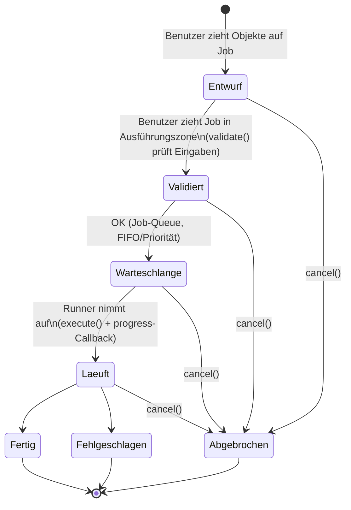

# Ianus – Task-Framework-Vertrag

Version: 0.1.0
Status: ENTWURF – freigabepflichtig

## 1. Prinzip

Jede Borg-Operation wird als **Task** modelliert. Ein Task ist eine eigenständige,
registrierbare Einheit mit definiertem Interface. Das Framework ist so gestaltet,
dass neue Tasks ohne Änderung am Kernsystem hinzugefügt werden können.

## 2. Task-Lebenszyklus



Zusätzlich: `cancel()` kann aus jedem aktiven Zustand aufgerufen werden.

## 3. Task-Registry

```c
int ianus_task_register(const ianus_task_t *task);
const ianus_task_t *ianus_task_find(const char *name);
void ianus_task_foreach(void (*cb)(const ianus_task_t *task, void *userdata), void *userdata);
```

Die Registry wird beim Daemon-Start befüllt. Phase 1 registriert die Tasks
statisch; Phase 2 kann dynamisch ladbare Module (`.so`) unterstützen.

## 4. Task-Katalog

### Phase 1 (MVP)

| Task      | Eingabe                    | Borg-Kommando                | Beschreibung                        |
|-----------|----------------------------|------------------------------|-------------------------------------|
| restore   | Liste von Pfad-Versionen   | `borg extract`               | Stellt Dateien wieder her           |
| check     | Repository                 | `borg check`                 | Prüft Repo-Integrität              |

### Phase 2

| Task      | Eingabe                    | Borg-Kommando                | Beschreibung                        |
|-----------|----------------------------|------------------------------|-------------------------------------|
| prune     | Repository + Regeln        | `borg prune`                 | Entfernt alte Archive nach Regeln   |
| compact   | Repository                 | `borg compact`               | Kompaktiert freigegebene Segmente   |
| mount     | Archiv oder Pfade          | `borg mount`                 | Mountet als FUSE-Dateisystem (r/o)  |
| create    | Pfade + Repository         | `borg create`                | Erstellt neues Archiv               |
| info      | Repository oder Archiv     | `borg info`                  | Zeigt detaillierte Informationen    |
| delete    | Archiv(e)                  | `borg delete`                | Löscht einzelne Archive             |
| rename    | Archiv                     | `borg rename`                | Benennt Archiv um                   |
| diff      | Zwei Archive               | `borg diff`                  | Zeigt Unterschiede zwischen Archiven|
| export-tar| Archiv + Pfade             | `borg export-tar`            | Exportiert als TAR-Archiv           |
| key       | Repository                 | `borg key change-passphrase` | Ändert Repository-Passphrase        |

### Phase 3+

- `transfer` (Repo-Migration)
- `benchmark` (Borg-Benchmark)
- Custom-Tasks über Plugin-Interface

## 5. Drag-&-Drop-Kompatibilität

Jeder Task definiert, welche Objekttypen als Eingabe akzeptiert werden:

| Eingabetyp     | Beschreibung                                    |
|----------------|-------------------------------------------------|
| `PATHS`        | Eine oder mehrere Pfad-Versionen aus dem Wald   |
| `REPO`         | Ein Repository-Objekt                           |
| `ARCHIVE`      | Ein oder mehrere Archive                        |
| `ARCHIVE_PAIR` | Genau zwei Archive (für diff)                   |
| `PATHS_AND_REPO`| Pfade + Ziel-Repository (für create)           |

Das Frontend nutzt diese Information, um visuelles Feedback beim Drag zu geben
(grüner Rahmen = kompatibel, roter Rahmen = inkompatibel).

## 6. Fortschrittsmeldung

```c
typedef struct {
    int percent;           // 0–100, -1 = unbestimmt
    uint64_t bytes_done;
    uint64_t bytes_total;
    uint64_t files_done;
    uint64_t files_total;
    const char *current_file;  // Aktuell verarbeitete Datei
    const char *message;       // Statusmeldung
} ianus_progress_t;

typedef void (*ianus_progress_cb)(const ianus_progress_t *progress, void *userdata);
```

Der Daemon sendet Fortschritt über WebSocket an verbundene Clients.

## 7. Berechtigungen

Jeder Task deklariert seine erforderliche Rolle. Der Task-Runner prüft vor
`execute()`, ob der auslösende Benutzer die Rolle im relevanten Scope besitzt.

---

**Dieses Dokument ist vor der ersten Implementierung vom Auftraggeber freizugeben.
Änderungen erfordern eine neue Version und erneute Freigabe.**
