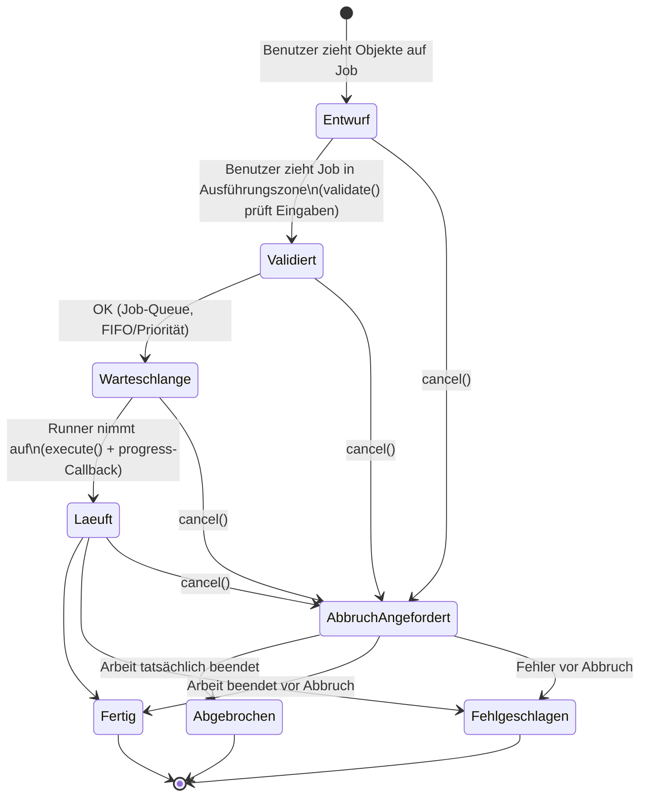

# Janus – Task-Framework-Vertrag

Version: 0.2.1
Status: ENTWURF – erneute Freigabe erforderlich (Sprachwechsel C -> Rust)

## 1. Prinzip

Jede Borg-Operation wird als **Task** modelliert. Ein Task ist eine eigenständige,
registrierbare Einheit mit definiertem Interface. Das Framework ist so gestaltet,
dass neue Tasks ohne Änderung am Kernsystem hinzugefügt werden können.

## 2. Task-Lebenszyklus



Zusätzlich: `cancel()` kann aus jedem aktiven Zustand aufgerufen werden. Der
Zwischenzustand `AbbruchAngefordert` bleibt aktiv, bis die Arbeit tatsächlich
beendet ist.

**Abbruch-Semantik:**

- `cancel()` ist eine **Abbruchanforderung**, kein sofortiger Zustandswechsel.
  `Abgebrochen` wird erst gesetzt, wenn die Arbeit tatsächlich beendet ist;
  solange der Abbruch läuft, bleibt der Task aktiv (UI: `Abbruch angefordert`).
- Der Runner leitet die Anforderung an das Backend weiter und bricht ab, wo
  unterstützt: DB-Backend-Abfragen per Query-Cancel (Cursor/Ressourcen werden
  freigegeben), Borg-Subprozesse über ein definiertes Cancel-Design (Signal,
  begrenzte Wartezeit, anschließendes Reap des Kindprozesses).
- Kritische Abschnitte ohne sicheren Stopp (Safe Stop Boundary) werden als nicht
  abbrechbar ausgewiesen; die Anforderung wird am nächsten sicheren Stopp-Punkt
  umgesetzt.
- Die Repo-Integrität bleibt gewahrt. Teileffekte/Teilergebnisse werden stets
  offengelegt und nie als vollständig präsentiert.
- Solange noch Arbeit ausgeführt wird, wird der Task nicht als `Abgebrochen`
  markiert.

## 3. Task-Registry

```rust
pub fn register(task: impl JanusTask + 'static) -> Result<(), RegistryError>;
pub fn find(name: &str) -> Option<Arc<dyn JanusTask>>;
pub fn for_each(f: impl FnMut(&Arc<dyn JanusTask>));
```

Die Registry wird beim Daemon-Start befüllt. Phase 1 registriert die Tasks
statisch; Phase 2 kann dynamisch ladbare Module unterstützen.

## 4. Task-Katalog

### Phase 1 (MVP)

| Task      | Eingabe                    | Borg-Kommando                | Beschreibung                        |
|-----------|----------------------------|------------------------------|-------------------------------------|
| restore   | Liste von Pfad-Versionen   | `borg extract`               | Stellt Dateien wieder her           |
| check     | Repository                 | `borg check`                 | Prüft Repo-Integrität              |

### Phase 2

| Task      | Eingabe                    | Borg-Kommando                | Beschreibung                        |
|-----------|----------------------------|------------------------------|-------------------------------------|
| prune     | Repository + Regeln        | `borg prune`                 | Entfernt alte Archive nach Regeln   |
| compact   | Repository                 | `borg compact`               | Kompaktiert freigegebene Segmente   |
| mount     | Archiv oder Pfade          | `borg mount`                 | Mountet als FUSE-Dateisystem (r/o)  |
| create    | Pfade + Repository         | `borg create`                | Erstellt neues Archiv               |
| info      | Repository oder Archiv     | `borg info`                  | Zeigt detaillierte Informationen    |
| delete    | Archiv(e)                  | `borg delete`                | Löscht einzelne Archive             |
| rename    | Archiv                     | `borg rename`                | Benennt Archiv um                   |
| diff      | Zwei Archive               | `borg diff`                  | Zeigt Unterschiede zwischen Archiven|
| export-tar| Archiv + Pfade             | `borg export-tar`            | Exportiert als TAR-Archiv           |
| key       | Repository                 | `borg key change-passphrase` | Ändert Repository-Passphrase        |
| break-lock| Repository                 | `borg break-lock`            | Entfernt stale Locks nach SIGKILL  |

### Phase 3+

- `transfer` (Repo-Migration)
- `benchmark` (Borg-Benchmark)
- Custom-Tasks über Plugin-Interface

## 5. Drag-&-Drop-Kompatibilität

Jeder Task definiert, welche Objekttypen als Eingabe akzeptiert werden:

| Eingabetyp     | Beschreibung                                    |
|----------------|-------------------------------------------------|
| `PATHS`        | Eine oder mehrere Pfad-Versionen aus dem Wald   |
| `REPO`         | Ein Repository-Objekt                           |
| `ARCHIVE`      | Ein oder mehrere Archive                        |
| `ARCHIVE_PAIR` | Genau zwei Archive (für diff)                   |
| `PATHS_AND_REPO`| Pfade + Ziel-Repository (für create)           |

Das Frontend nutzt diese Information, um visuelles Feedback beim Drag zu geben
(grüner Rahmen = kompatibel, roter Rahmen = inkompatibel).

## 6. Fortschrittsmeldung

```rust
pub struct Progress {
	pub percent: Option<u8>,     // 0–100, None = unbestimmt
	pub bytes_done: u64,
	pub bytes_total: Option<u64>,
	pub files_done: u64,
	pub files_total: Option<u64>,
	pub current_file: Option<String>,
	pub message: String,
}

pub type ProgressSink = mpsc::Sender<Progress>;  // an WebSocket-Fanout
```

Der Daemon sendet Fortschritt über WebSocket an verbundene Clients.

**Fortschrittsstufen und Indikatoren:**

- Fortschritt ist strukturiert: bekannte Gesamtmenge, erledigte Zähler
  (Dateien/Bytes/Items) und verstrichene Zeit. Eine ETA wird nur angegeben, wenn
  sie aus gemessener Arbeit ableitbar ist; bei unbekannter Gesamtmenge bleibt der
  Fortschritt unbestimmt (indeterminate).
- Auch wenn Borg schweigt, meldet der Task die aktuelle Phase und bearbeitete
  Arbeitselemente/Zähler. Granulare Borg-Fortschrittsdaten werden nicht erfunden,
  wenn sie nicht verfügbar sind.

## 7. Berechtigungen

Jeder Task deklariert seine erforderliche Rolle. Der Task-Runner prüft vor
`execute()`, ob der auslösende Benutzer die Rolle im relevanten Scope besitzt.

---

**Dieses Dokument ist vor der ersten Implementierung vom Auftraggeber freizugeben.
Änderungen erfordern eine neue Version und erneute Freigabe.**
