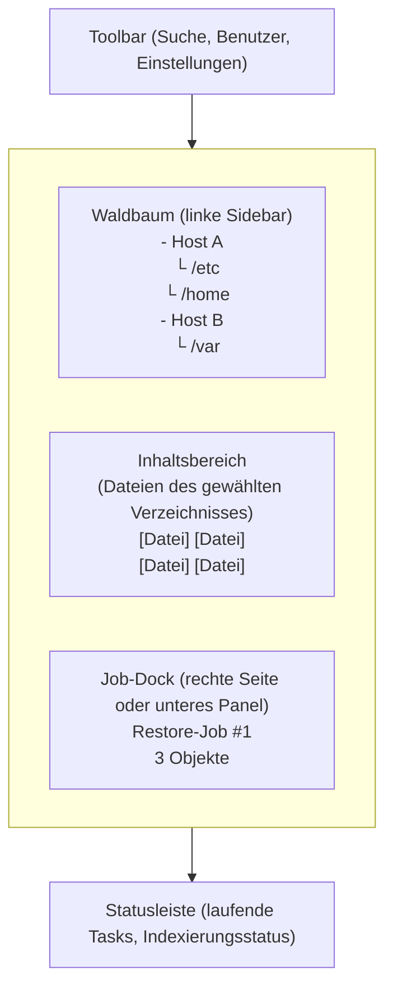

# Janus – UX-Workflow-Vertrag

Version: 0.2.0
Status: FREIGEGEBEN

## 1. Zentrale Metapher

Janus präsentiert dem Benutzer einen **Wald**: eine Menge von Bäumen, deren
Wurzeln die gesicherten Hosts/Repositories sind. Der Benutzer navigiert diesen
Wald wie ein Dateisystem – sieht aber stets den **aktuellsten Stand** jeder Datei
über alle Archive hinweg, ohne Archive manuell auswählen zu müssen.

## 2. Hauptbereiche der Oberfläche

Die Position des Job-Docks ist vom Benutzer wählbar: rechts neben dem
Inhaltsbereich oder als Panel unten. Die Wahl ist jederzeit umschaltbar und wird
benutzerbezogen gespeichert. Auf dem Desktop stehen beide Optionen zur
Verfügung; auf Tablets ist unten die bevorzugte Variante, die Wahl bleibt aber
möglich, soweit Platz und Bedienbarkeit gewährleistet sind.

## 3. Interaktionen

### 3.1 Waldbaum-Navigation
- Baumknoten expandieren per Klick.
- Lazy-Loading: Kinder werden bei Expansion via API geladen.
- Suchfeld filtert den gesamten Baum (serverseitig, mit Debounce).
- Der Baum zeigt nur die vollständig veröffentlichte aktuelle Generation je
  Repository.

### 3.2 Rechtsklick → Kontextmenü
Auf jedes Objekt (Datei oder Verzeichnis):
- **Historie anzeigen**: Zeigt alle Versionen aus allen Archiven, chronologisch.
  Jede Version zeigt: Archivname, Datum, Größe, Änderungstyp (neu/geändert/gelöscht)
  sowie den Generation-/Archivkontext.
- **Zum Restore vormerken**: Pinnt die ausgewählte unveränderliche konkrete
  Pfadversion inklusive Generation und fügt sie dem aktiven Job hinzu. Neue
  Indizierung verschiebt die Job-Auswahl dadurch nicht.
- **Neuen Job erstellen**: Erstellt ein neues leeres Job-Objekt.
- **Eigenschaften**: Zeigt Metadaten (Rechte, Eigentümer, Größe, Hash).

### 3.3 Drag & Drop
- **Datei/Verzeichnis → Job-Dock**: Erstellt neuen Job oder fügt zum aktiven hinzu.
  Die ausgewählte konkrete Pfadversion wird inklusive Generation gepinnt.
- **Datei/Verzeichnis → bestehendes Job-Objekt**: Fügt dem Job hinzu (gepinnte
  Version).
- **Job-Objekt → Ausführungszone**: Startet den Job (mit Bestätigungsdialog).
- **Task-Typ-Karten → Job-Objekt**: Ändert den Task-Typ eines Jobs
  (z. B. von "Restore" zu "Check").

### 3.4 Job-Dock
- Zeigt alle offenen Job-Objekte als Karten.
- Jede Karte zeigt: Typ, Anzahl Objekte, geschätzte Größe.
- Karten sind aufklappbar → zeigt die enthaltenen Pfade.
- Status: `Entwurf` → `In Warteschlange` → `Läuft` (mit Fortschrittsbalken) → `Fertig` / `Fehlgeschlagen` / `Abgebrochen`; während eines laufenden Abbruchs zeigt die Karte `Abbruch angefordert`.
- Abgeschlossene Jobs bleiben in der Historie sichtbar.
- Jobs können unterschiedliche gepinnte Generationen enthalten.

### 3.5 Ausführungszone
- Ein definierter Bereich (z. B. unterer Rand oder spezielles Drop-Target),
  auf den man einen Job zieht um ihn zu starten.
- Vor Ausführung: Bestätigungsdialog mit Zusammenfassung (was, wohin, geschätzte Dauer).
- Bei Restore: Zielverzeichnis-Auswahl im Dialog.
- Vor Ausführung werden Revision/Referenzen der gepinnten Items validiert. Bei
  fehlenden oder inkonsistenten referenzierten Daten bricht der Job ab, statt
  unbemerkt auf die neueste Version umzuschalten.

### 3.6 Ladevorgänge und lange Aufgaben

- Jede potenziell lange Aktion – Host/Repo öffnen, Index-/Baumladen,
  Remote-DB-Abfrage, Backup erstellen, Restore, Check, Prune – zeigt stets die
  aktuelle Phase, was Janus gerade tut, aussagekräftige Zähler (erledigt/gesamt)
  und die verstrichene Zeit.
- Restzeit/ETA nur, wenn sie aus gemessener Arbeit glaubwürdig ableitbar ist;
  sonst unbestimmter Fortschritt und ehrlicher Status. Prozentwerte und ETAs
  werden nie erfunden.
- Das Feedback bleibt live, klar und ruhig (CleanMyMac-Anmutung) und vermittelt,
  dass Warten sinnvoll ist.
- Das Anlegen von Backups/Archiven wirkt beruhigend und motivierend durch
  Klarheit, eine Abschluss-Zusammenfassung und verständliche Ergebnisse – nicht
  durch Gamification oder unechte Erfolgsversprechen.
- Abschließbare Arbeit bietet Cancel. Ein Bestätigungsdialog erscheint nur, wenn
  der Abbruch Nebenwirkungen riskiert. Nach einer Cancel-Anfrage zeigt die UI
  `Abbruch angefordert`, bis Backend/Prozess tatsächlich gestoppt ist; danach
  `Abgebrochen`/`Gestoppt` oder die tatsächlichen Teileffekte.
- Bei Remote-DB-Laden stoppt Cancel die Anfrage/den Scan, wo unterstützt, und
  gibt Cursor/Ressourcen frei. Unvollständige Daten werden nie als vollständig
  präsentiert.

## 4. Konfigurationsbereich

Erreichbar über Einstellungen-Icon in der Toolbar:
- **Repositories**: Liste aller Repo-Objekte, Hinzufügen/Bearbeiten/Löschen, Verbindungstest.
- **Benutzer & Gruppen**: CRUD, Rollenzuordnung.
- **Rollen**: Berechtigungen definieren, Scope festlegen.
- **Tasks**: Übersicht registrierter Task-Typen (read-only in Phase 1).
- **System**: Indexierungsintervall, Log-Level, DB-Backend, Daemon-Status.

## 5. Responsive Verhalten

- Primärziel: Desktop-Browser (≥ 1280px).
- Tablet (≥ 768px): Sidebar einklappbar, Job-Dock als unteres Panel.
- Mobil: Nicht im Kernscope, aber Layout bricht nicht.

### 5.1 Pane-Größen und Layout-Persistenz

- Panes sind per Maus veränderbar (Trenner zwischen den Panels ziehen);
  Doppelklick auf einen Trenner setzt die Spalten auf Standardgrößen zurück.
- Das Web-UI wächst dynamisch vertikal mit seinen Inhalten (z. B. Task-Objekte
  unten); Scrollen bleibt auf die betroffenen Panels beschränkt.
- Layoutänderungen werden sofort gesichert (entprellt) – ohne explizites
  „Speichern“.
- Layout und UI-Zustand (offene Hosts/Detail-Objekte, expandierte Baumknoten,
  Task-Entwürfe) überstehen Browser-Reloads und Backend-Restarts.
- Persistenzort ist der `cfg/`-Keyspace im Backend über die KV Access API
  (kein separater UI-Zustandsspeicher, keine doppelte Datenhaltung): Der Daemon
  lädt den Zustand beim Start, der Client beim Verbinden.
- Mit Einführung der Benutzerverwaltung wird das Layout benutzerspezifisch
  gespeichert; bis dahin global.

## 6. Design-Sprache

- Starke gestalterische Anlehnung an CleanMyMacs klare, hochwertige, ruhige
  Utility-Anmutung – ohne pixelgenaue Kopie.
- Konsistente Abstände, klare Hierarchie, leichte Oberflächen/Karten.
- Zurückhaltende Akzentfarbe und verständliche Icons.
- Farbschema: Neutrales Grau + ein Akzentton (vorläufig Blau/Teal, anpassbar).
- **Verbindliche Palette** („Janus Teal", aus Mockup 05; siehe auch
  `docs/mockups/janus-ui-mockup.html`):

  | Rolle | Hell | Dunkel |
  |---|---|---|
  | Seitenhintergrund `--page` | `#edf0ef` | `#151918` |
  | Flächen/Panels `--paper` | `#ffffff` | `#1d2321` |
  | Panelinnenfläche `--panel` | `#f7f9f8` | `#232a28` |
  | Trennlinien `--line` | `#e1e7e4` | `#2f3734` |
  | Text `--ink` | `#202927` | `#e3eae7` |
  | Sekundärtext `--muted` | `#6e7975` | `#9aa8a3` |
  | Tertiärtext `--soft` | `#909a96` | `#76827e` |
  | **Akzent** `--accent` | `#168b78` | `#3fb394` |
  | Akzentfläche `--accent-pale` | `#e7f4f0` | `#20312c` |
  | Akzentkontur `--accent-line` | `#9acbbd` | `#33544b` |
  | Gefahr/Abbruch `--danger` | `#b3564d` | `#d98177` |
  | Baumkonnektoren `--treeline` | `#c3ccc8` | `#3a4441` |

  Diese Werte sind die Referenz; Frontend und Mockups nutzen sie unverändert
  als CSS Custom Properties. Andere Themes dürfen als Alternative definiert
  werden, „Janus Teal" bleibt Standard.
- Icons: Lucide oder Phosphor (MIT-lizenziert).
- **App-Icon**: `assets/janus app icon.png` (verkleinerte Referenz:
  `docs/assets/janus-app-icon-256.png`) ist das verbindliche App-Icon und wird
  ab sofort in allen Janus-Oberflächen (Favicon, Toolbar-Marke, About/Info)
  verwendet.
- **Repo-Logo**: `assets/janus repo logo.png` (Referenz:
  `docs/assets/janus-repo-logo-400.png`) ist das verbindliche Logo für
  README und Dokumentation.
- Typografie: System-Font-Stack (`-apple-system, BlinkMacSystemFont, "Segoe UI", ...`).
- Der Benutzer muss keine UX-/Designvorgaben liefern.

### 6.1 Animationen

- Subtile, funktionale Transitionen für Panel-/Dock-Wechsel, Drag-and-drop-
  Feedback, Job-Zustände und Fortschritt.
- Kurz, konsistent, keine ablenkenden Effekte; nie als einzige Zustandsanzeige.
- `prefers-reduced-motion` wird respektiert: Animationen werden dann deaktiviert
  oder reduziert.
- Dauer: dezent, max. 300ms.
- Lade- und Fortschrittsanzeigen bleiben konsistent zur bestehenden Gestaltung
  (siehe 3.6); keine abweichenden Lade-Muster.

## 7. Mockup-Review vor Frontend-Implementierung

- Vor der Frontend-Implementierung präsentiert die AI ein verständlich
  annotiertes Mockup der zentralen Oberfläche, inklusive der Umschaltung des
  Job-Docks (rechts/unten) und des Restore-Jobs per Drag & Drop.
- Das Mockup enthält eine empfohlene Startvariante und einfache Feedbackfragen.
- Die AI führt den Benutzer ohne UX-Vorkenntnisse durch die Entscheidungen.
- Erst nach Nutzerfeedback/Freigabe wird die Frontend-Implementierung
  vorgeschlagen.

---

**Dieses Dokument ist vor der ersten Implementierung vom Auftraggeber freizugeben.
Änderungen erfordern eine neue Version und erneute Freigabe.**
